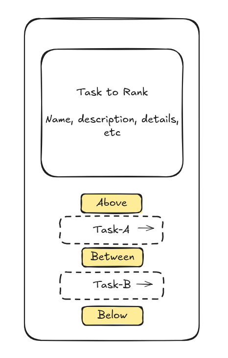

## Selection mode: Interactive Insertion

The idea here is a sort of insertion sort. You start off with the list of tasks and an empty list of the "sorted" tasks. We take the tasks one at a time (the "selected task" and decide where they go in the sorted list. We do that by picking two tasks from the sorted list (the "comparison tasks") and then asking the user if the target-task should be ranked above, between, or below the tasks. That narrows down the range of ranked tasks to compare against, and we repeat until we have an exact position for the target-task. We insert the target task into its ranked position and it is now a sorted task. Repeat this until everything is sorted!

So this is like a trisect insertion sort. The idea is to make it pretty easy to find the right spot for the task after only a few steps, while making the decision pretty easy for a human at each step to perform quickly and visually.

Here is a sketch:

